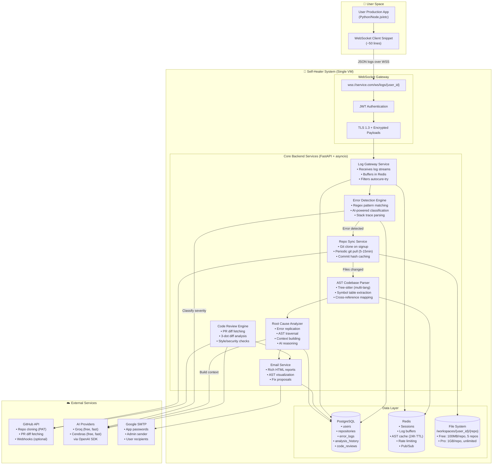
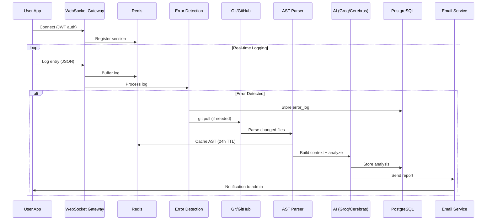
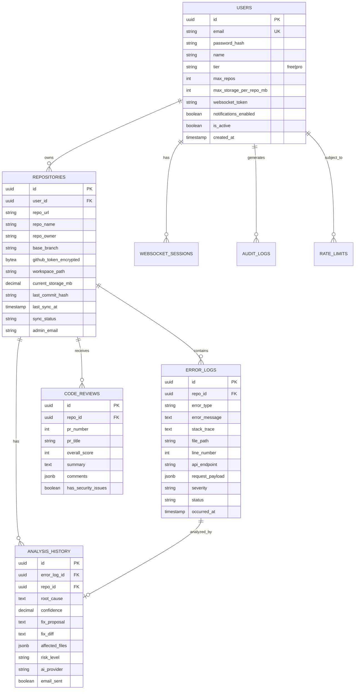
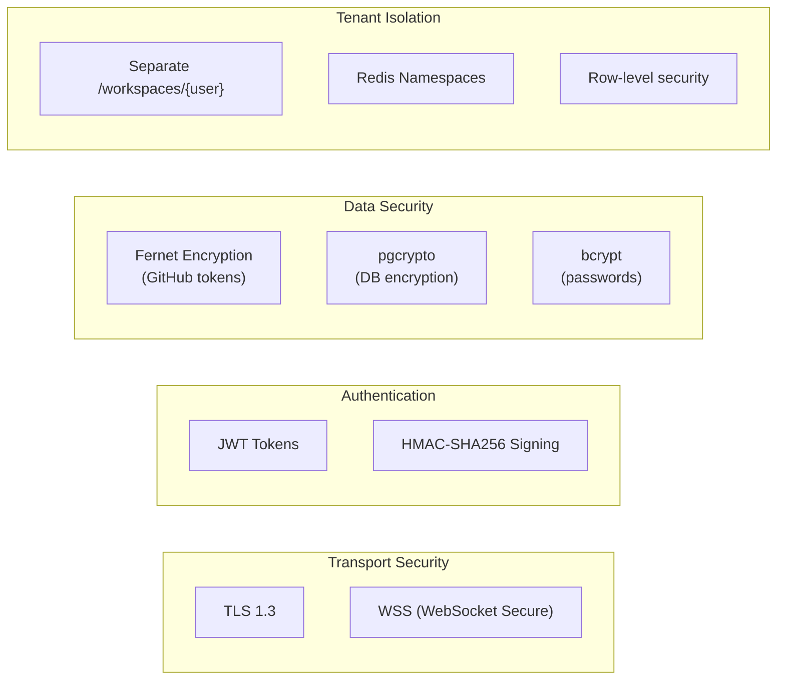

# Self-Healing Software System v2.0 - Architecture

## System Overview

The Self-Healing Software System v2.0 is an AI-powered **error detection and fix proposal** platform. It receives real-time logs via WebSocket from user production apps, detects errors, traces them through AST analysis, and **proposes fixes** (without applying them). The system also reviews PRs for code quality.

**Key Principle**: The system **proposes fixes only** - it does NOT automatically apply changes to user code.

## System Architecture Diagram



## Data Flow Diagram



## Database Schema (ERD)



## Component Responsibilities

### 1. WebSocket Client Snippet (~50 lines)
**Runs in user's production app**

- **Role**: Captures and forwards logs (does NOT trace errors)
- **Features**:
  - Captures stdout/stderr
  - Intercepts application logs
  - Captures error stack traces
  - Auto-reconnection with heartbeat (30s)
  - Adds metadata (timestamp, level)
- **Output**: JSON log entries over secure WebSocket

### 2. Error Detection Engine
**Our system traces the error**

- **Role**: Identifies errors from log streams
- **Features**:
  - Regex patterns for common errors
  - AI-powered classification (Groq/Cerebras)
  - Stack trace extraction and parsing
  - API endpoint correlation
  - Severity assessment
- **Filters out**: Logs with `autocure-try: true` flag

### 3. AST Codebase Parser
- **Role**: Builds searchable code structure
- **Features**:
  - Tree-sitter for multi-language support
  - Symbol table extraction
  - Cross-reference mapping
  - Cached in Redis (24h TTL)

### 4. Root Cause Analyzer
- **Role**: AI-powered error investigation
- **Pipeline**:
  1. Parse stack trace → identify file/line/function
  2. AST traversal → walk parents/children/dependencies
  3. Context building → compile {logs, ast, code, deps}
  4. AI reasoning → root cause + fix proposal
- **Output**: Proposal only (NOT applied)

### 5. Email Service
- **Role**: Delivers rich HTML reports
- **Sender**: Admin email (Google App Password)
- **Recipients**: Per-repo admin from `repositories.admin_email`

## Storage Tiers

| Feature | Free Tier | Pro Tier (Future) |
|---------|-----------|-------------------|
| Max Repositories | 5 | Unlimited |
| Storage per Repo | 100 MB | 1 GB |
| Rate Limit (logs/sec) | 100 | 500 |
| Rate Limit (PRs/hour) | 10 | 50 |

## Security Architecture



## External Services

| Service | Purpose | Auth Method |
|---------|---------|-------------|
| **GitHub API** | Repo clone, PR diffs | User's PAT (read-only) |
| **Groq** | AI inference (free, fast) | API Key via OpenAI SDK |
| **Cerebras** | AI inference (free, fast) | API Key via OpenAI SDK |
| **Google SMTP** | Email delivery | App Password |

### About GitHub PAT Access

- User generates PAT with `repo:read` scope from their GitHub account
- PAT allows reading private repos **that the user owns/has access to**
- Token is encrypted at rest using pgcrypto
- Future: Can implement GitHub OAuth App for seamless authorization

## Deployment (Single VM)

```
┌─────────────────────────────────────────────────────────────┐
│                     Single VM (4+ vCPU, 8+ GB RAM)          │
├─────────────────────────────────────────────────────────────┤
│  ┌─────────────────┐  ┌─────────────────┐                   │
│  │   Nginx         │  │   FastAPI       │                   │
│  │   (Reverse      │──│   (Uvicorn      │                   │
│  │    Proxy, SSL)  │  │    Workers)     │                   │
│  └─────────────────┘  └─────────────────┘                   │
│                              │                               │
│           ┌──────────────────┼──────────────────┐           │
│           │                  │                  │           │
│  ┌────────▼────────┐ ┌───────▼───────┐ ┌───────▼───────┐   │
│  │   PostgreSQL    │ │    Redis      │ │  File System  │   │
│  │   (Port 5432)   │ │   (Port 6379) │ │  /workspaces  │   │
│  └─────────────────┘ └───────────────┘ └───────────────┘   │
└─────────────────────────────────────────────────────────────┘
```

## Future Enhancements (Not for MVP)

1. **Frontend Dashboard** (React/Next.js)
   - User registration/login
   - Repository management
   - Error reports viewer

2. **GitHub OAuth App**
   - Seamless repo authorization
   - No PAT copy-paste

3. **Cloud Storage** (S3/GCS)
   - Long-term report archives
   - AST visualization storage

4. **Horizontal Scaling**
   - Multiple FastAPI pods
   - Redis cluster
   - Load balancer   │
                    │  │  2. Generate fix proposal      │   │
                    │  │  3. Generate test cases        │   │
                    │  │  4. Run tests in sandbox       │   │
                    │  │  5. Pass? → Complete           │   │
                    │  │  6. Fail? → Improve & retry    │   │
                    │  └─────────────────────────────────┘   │
                    └────────────────────┬────────────────────┘
                                         │
                                         ▼
                    ┌─────────────────────────────────────────┐
                    │          EMAIL NOTIFIER                 │
                    │                                         │
                    │  • SMTP with TLS                       │
                    │  • Gmail App Password auth             │
                    │  • HTML + Plain text reports           │
                    │  • Git branch links                    │
                    │  • Test results summary                │
                    └─────────────────────────────────────────┘
```

## Component Descriptions

### 1. Main Orchestrator (`src/main.py`)

The central coordinator that manages the entire self-healing workflow.

**Responsibilities:**
- Initialize all subprocess components
- Start and monitor the target service
- Listen for error events from the log watcher
- Trigger the healing workflow when errors are detected
- Coordinate between components
- Handle graceful shutdown

**Workflow:**
```python
async def run():
    1. Initialize all components
    2. Start target service (subprocess2)
    3. Start log watcher (subprocess1)
    4. Wait for error detection
    5. On error:
       a. Process error (subprocess3)
       b. Run AI healing agent
       c. Create git branch (subprocess4)
       d. Send email notification
    6. Continue monitoring
```

### 2. Log Watcher - Subprocess 1 (`src/subprocesses/log_watcher.py`)

Monitors log files for errors and warnings in real-time.

**Features:**
- Asynchronous file watching
- Pattern-based error detection
- Stack trace parsing
- Multiple error type recognition (TypeError, ReferenceError, etc.)
- Severity classification

**Detection Patterns:**
- `Error:`, `TypeError:`, `ReferenceError:`, `SyntaxError:`
- `[ERROR]`, `FATAL:`, `Exception:`
- Stack trace lines (`at function (file:line:column)`)

### 3. Target Service - Subprocess 2 (`demo_service/server.js`)

The application being monitored (demo Node.js server with intentional bugs).

**Intentional Error Zones:**
1. Undefined variable access
2. Array index out of bounds
3. Division by zero
4. Undefined callbacks
5. JSON parsing without error handling

### 4. Error Processor - Subprocess 3 (`src/subprocesses/error_processor.py`)

Traces errors to their origin in source code.

**Capabilities:**
- Stack trace parsing (JavaScript, Python patterns)
- Source file resolution
- Code context extraction (lines before/after error)
- Root cause analysis
- Related file discovery

### 5. Git Handler - Subprocess 4 (`src/subprocesses/git_handler.py`)

Manages version control operations for fix branches.

**Operations:**
- Create uniquely named fix branches (`ai-fix/error-type-timestamp-id`)
- Apply fixes to target files
- Generate descriptive commit messages
- Optional push to remote
- PR/MR information generation

### 6. AI Healing Agent (`src/agents/healing_agent.py`)

The core AI-powered healing logic.

**Process:**
```
┌─────────────────────────────────────────────────────────────┐
│                    HEALING AGENT WORKFLOW                    │
└─────────────────────────────────────────────────────────────┘
                              │
                              ▼
                    ┌─────────────────┐
                    │ Receive Error   │
                    │ Info            │
                    └────────┬────────┘
                              │
                              ▼
                    ┌─────────────────┐
                    │ Read Source     │
                    │ Code            │
                    └────────┬────────┘
                              │
                              ▼
              ┌───────────────────────────────┐
              │      FIX ATTEMPT LOOP         │
              │      (max 5 attempts)         │
              │                               │
              │   ┌─────────────────────┐    │
              │   │ Generate Fix (AI)   │    │
              │   └──────────┬──────────┘    │
              │              │               │
              │              ▼               │
              │   ┌─────────────────────┐    │
              │   │ Generate Tests (AI) │    │
              │   └──────────┬──────────┘    │
              │              │               │
              │              ▼               │
              │   ┌─────────────────────┐    │
              │   │ Run Tests in        │    │
              │   │ Sandbox             │    │
              │   └──────────┬──────────┘    │
              │              │               │
              │         ┌────┴────┐          │
              │         │ PASS?   │          │
              │         └────┬────┘          │
              │              │               │
              │     YES ─────┼───── NO       │
              │       │      │      │        │
              │       ▼      │      ▼        │
              │   Complete   │   Analyze     │
              │              │   Failure     │
              │              │      │        │
              │              │      ▼        │
              │              │   Improve     │
              │              │   Fix         │
              │              │      │        │
              │              └──────┘        │
              └───────────────────────────────┘
```

### 7. AI Client (`src/agents/ai_client.py`)

Unified interface for AI providers using OpenAI-compatible APIs.

**Supported Providers:**
| Provider | Base URL | Models |
|----------|----------|--------|
| Groq | `https://api.groq.com/openai/v1` | llama-3.3-70b-versatile, llama-3.1-8b-instant, mixtral-8x7b-32768 |
| Cerebras | `https://api.cerebras.ai/v1` | llama3.1-8b, llama3.1-70b |

**API Methods:**
- `chat_completion()` - General chat completions
- `generate_fix()` - Error-specific fix generation
- `generate_tests()` - Test case generation
- `analyze_test_failure()` - Failure analysis and fix improvement

### 8. Email Notifier (`src/subprocesses/email_notifier.py`)

Sends comprehensive email reports to administrators.

**Features:**
- SMTP with TLS encryption
- Gmail App Password authentication
- HTML formatted reports with styling
- Plain text fallback
- Report contents:
  - Error details and severity
  - Root cause analysis
  - Fix explanation
  - Test results
  - Git branch information

## Data Models (`src/utils/models.py`)

### LogEntry
Represents a single log entry with timestamp, level, message, source, and stack trace.

### ErrorInfo
Detailed error information including:
- Error type and message
- Stack trace
- Source file and line
- Severity level
- Code context
- Root cause analysis

### FixProposal
A proposed fix with:
- Original and fixed code
- Explanation
- Confidence score
- Status (pending, testing, passed, failed)
- Attempt number

### TestResult
Test execution results:
- Pass/fail status
- Test counts
- Output and error messages
- Execution time

### HealingReport
Complete healing operation report:
- All fix proposals
- All test results
- Final fix (if successful)
- Git information
- Summary generation

## Configuration

### Environment Variables

| Variable | Description | Default |
|----------|-------------|---------|
| `AI_PROVIDER` | AI provider (groq/cerebras) | groq |
| `GROQ_API_KEY` | Groq API key | - |
| `CEREBRAS_API_KEY` | Cerebras API key | - |
| `SMTP_SERVER` | SMTP server address | smtp.gmail.com |
| `SMTP_PORT` | SMTP server port | 587 |
| `SENDER_EMAIL` | Email sender address | - |
| `SENDER_PASSWORD` | Email app password | - |
| `ADMIN_EMAIL` | Admin notification email | - |
| `MAX_FIX_ATTEMPTS` | Maximum fix attempts | 5 |
| `LOG_WATCH_INTERVAL` | Log check interval (seconds) | 1.0 |
| `TEST_TIMEOUT` | Test execution timeout (seconds) | 60 |

## Security Considerations

1. **API Keys**: Store in `.env` file, never commit to version control
2. **Email Credentials**: Use App Passwords, not actual passwords
3. **Git Operations**: Ensure proper SSH/HTTPS authentication
4. **Sandbox Testing**: Fixes are tested in isolated temporary directories

## Scalability

The system can be extended for:
- Multiple monitored services
- Different programming languages
- Custom error patterns
- Additional AI providers
- Distributed deployment with message queues
- Kubernetes integration (see full implementation plan)

## Error Handling

- Graceful degradation when AI fails
- Retry logic for API calls
- Timeout handling for tests
- Cleanup of temporary directories
- Signal handling for shutdown

## Future Enhancements

1. Web dashboard for monitoring and approvals
2. Slack/Teams integration
3. Custom plugin system for error handlers
4. Machine learning for error pattern recognition
5. Automated PR creation
6. Multi-language support (Python, Java, Go)
7. Container-based testing environments
8. Integration with CI/CD pipelines
